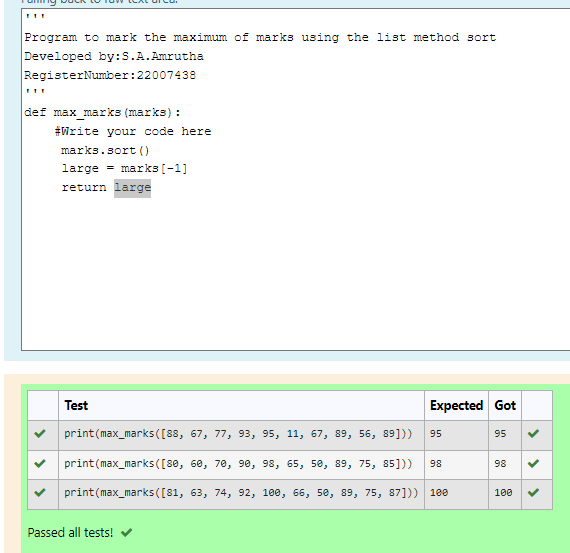
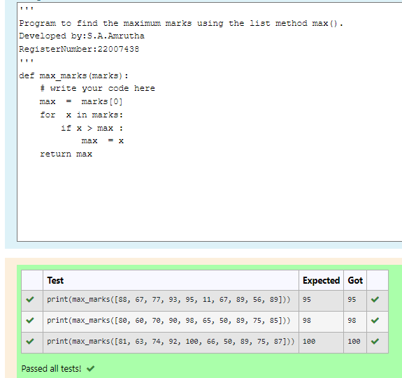
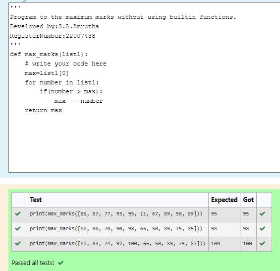

# Find the maximum of a list of numbers
## Aim:
To write a program to find the maximum of a list of numbers.

## Equipment’s required:
1.	Hardware – PCs
2.	Anaconda – Python 3.7 Installation / Moodle-Code Runner

## Algorithm:
1.	Get the list of marks as input

2.	Use the sort() function or max() function or use the for loop to find the maximum mark.

3.	Return the maximum value

## Program:
Developed by:S.A.Amrutha 
RegisterNumber:22007438 
```
i)	# To find the maximum of marks using the list method sort.

def max_marks(marks):
    #Write your code here
     marks.sort()
     large = marks[-1]
     return large


ii)	# To find the maximum marks using the list method max().

def max_marks(marks):
    # write your code here
    max  =  marks[0]
    for  x in marks:
        if x > max :
            max  = x
    return max        


iii) # To find the maximum marks without using builtin functions.

def max_marks(list1):
    # write your code here
    max=list1[0]
    for number in list1:
        if(number > max):
            max  = number
    return max        
```
## Sample Input and Output:
i) To find the maximum of marks using the list method sort.


ii)	To find the maximum marks using the list method max().


iii)To find the maximum marks without using builtin functions.


## Output:
i) To find the maximum of marks using the list method sort.


ii)	To find the maximum marks using the list method max().


iii)To find the maximum marks without using builtin functions.


## Result:
Thus the program to find the maximum of given numbers from the list is written and verified using python programming.